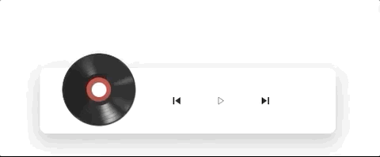

## Web Components Audio Player


<center>



</center>


add this code in body
```
<script src="audio-player.js"></script>
```

and 

```
<audio-player mute="false" source="test1.mp3" />
```

### Future list
* Skip buttons
* Playlist
* Mute
* Npm support 
* Progress bar improve seekable 
